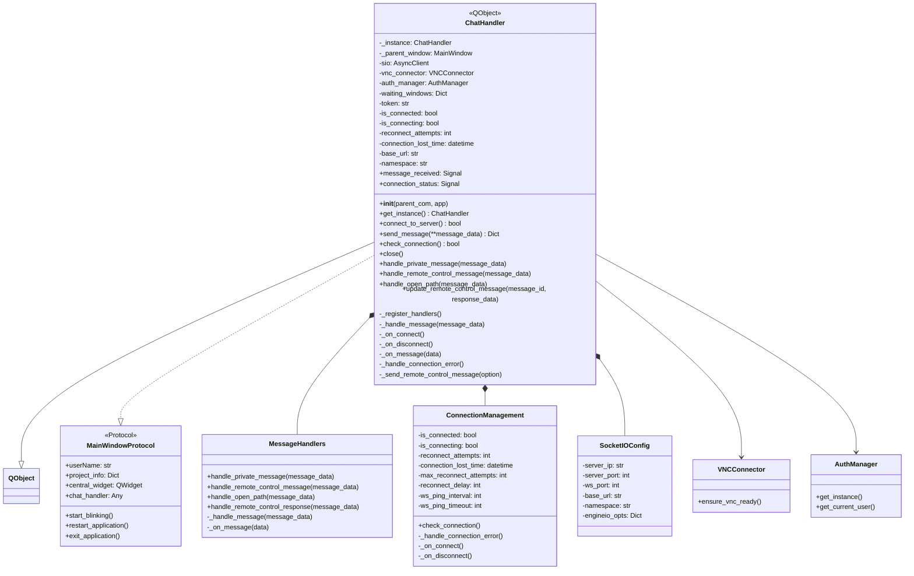
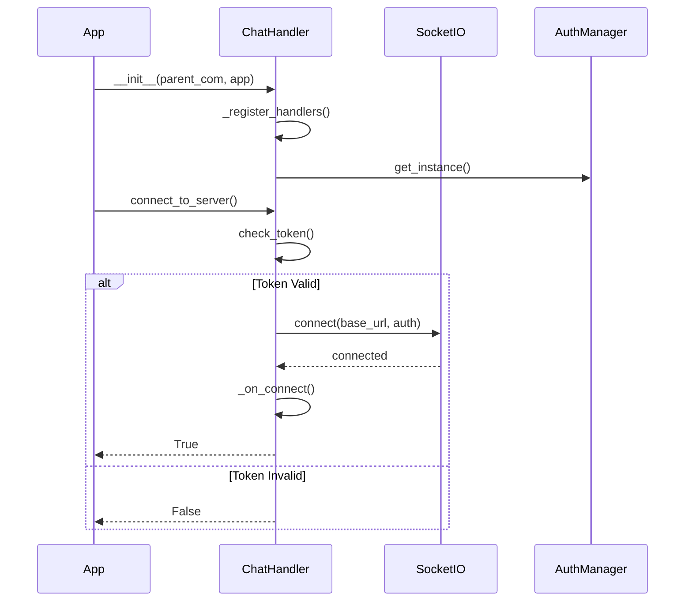
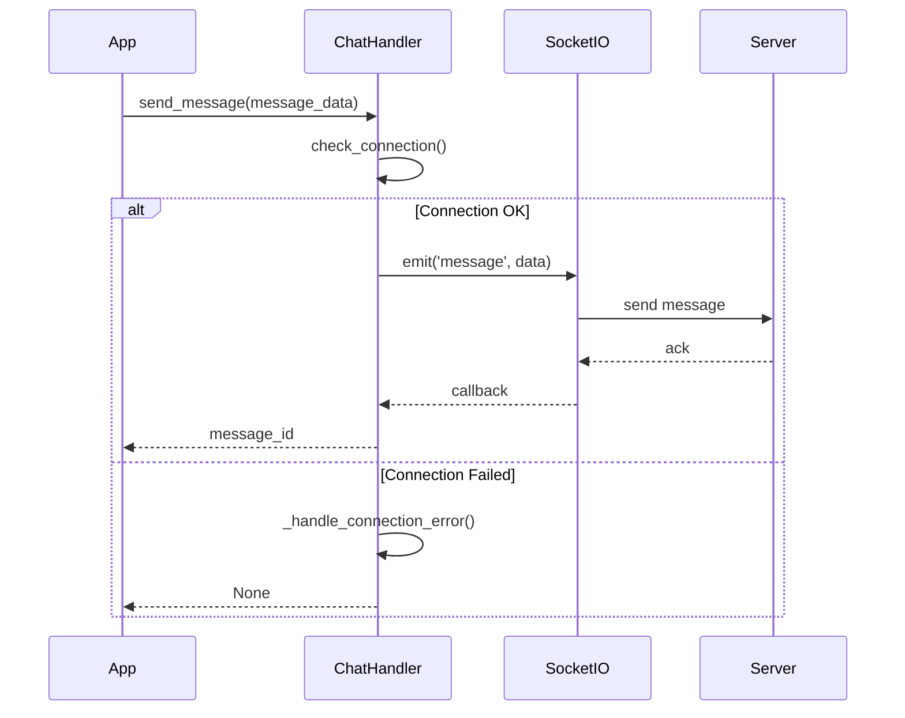
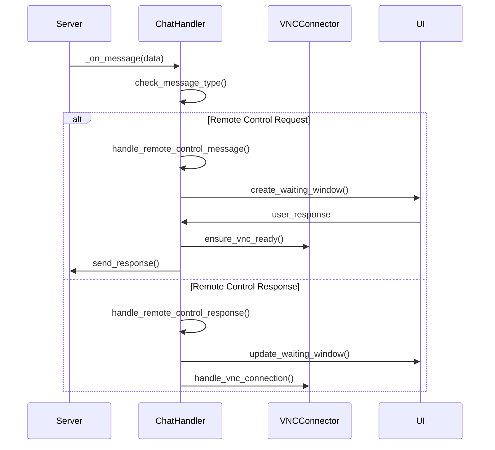
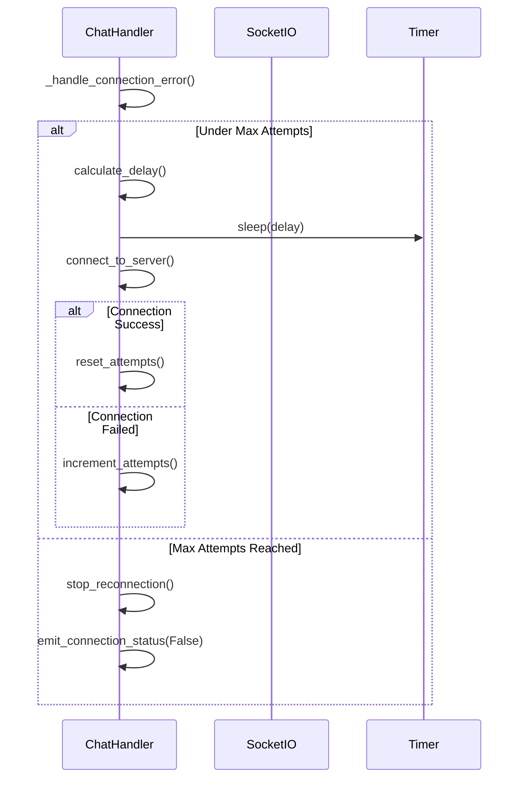
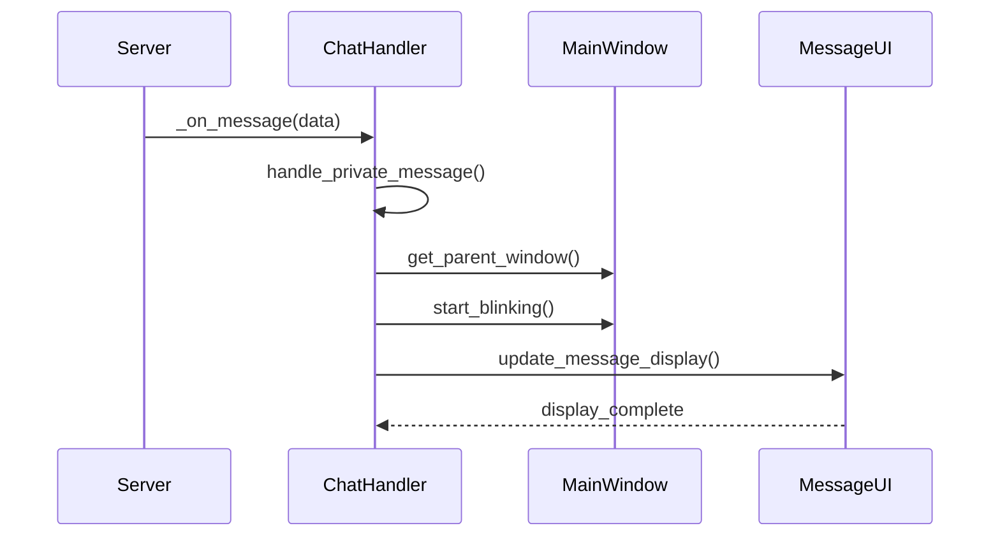
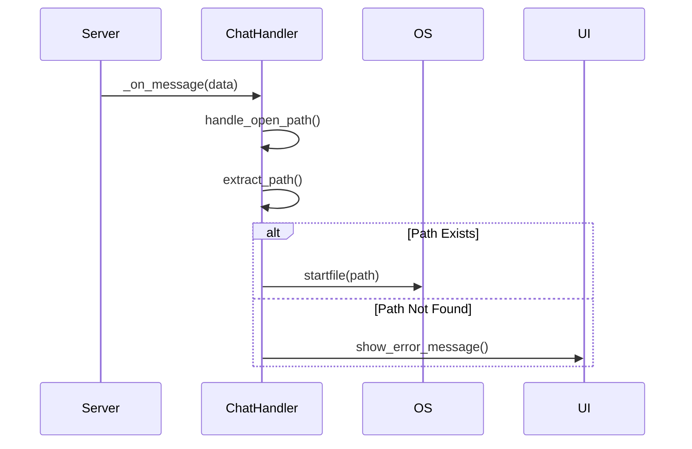
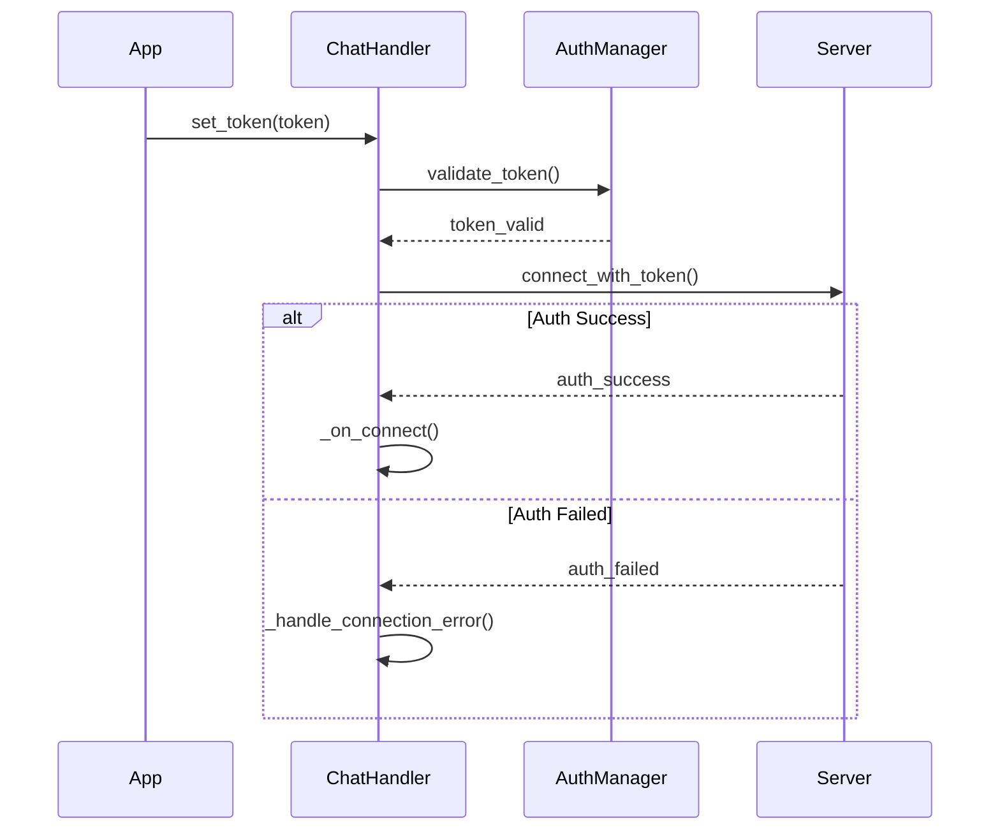
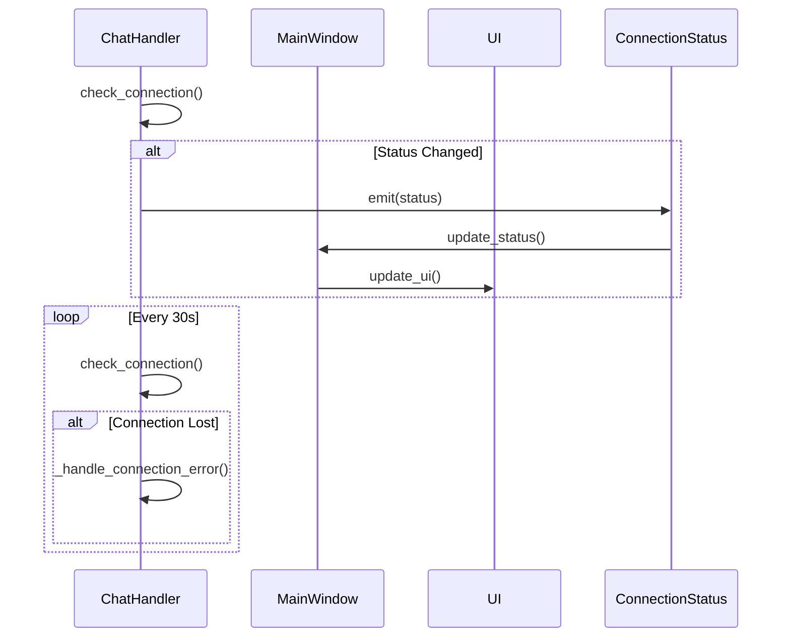

# ChatHandler类图设计文档

本文档使用Mermaid语法描述了ChatHandler类的结构设计。

## 类图



## 类详细说明

### ChatHandler
核心功能类，负责处理所有聊天相关操作。

#### 重要属性
- **信号**
  - `message_received`: 新消息接收信号
  - `connection_status`: 连接状态变化信号

- **配置相关**
  - `server_ip`: 服务器IP地址
  - `server_port`: 服务器端口
  - `ws_port`: WebSocket端口
  - `base_url`: 基础URL
  - `namespace`: Socket.IO命名空间

- **状态管理**
  - `is_connected`: 当前连接状态
  - `is_connecting`: 是否正在连接
  - `reconnect_attempts`: 重连尝试次数
  - `connection_lost_time`: 连接丢失时间

#### 核心方法
1. **初始化相关**
   ```python
   def __init__(self, parent_com, app):
       # 初始化配置
       self.server_ip = os.getenv('SERVER_IP', '127.0.0.1')
       self.server_port = int(os.getenv('SERVER_PORT', '1026'))
       # 初始化Socket.IO客户端
       self.sio = socketio.AsyncClient(...)
   ```

2. **连接管理**
   ```python
   async def connect_to_server(self) -> bool:
       # 检查token
       if not self.token:
           return False
       # 建立连接
       await self.sio.connect(...)
   ```

3. **消息处理**
   ```python
   async def handle_remote_control_message(self, message_data):
       # 处理远程控制消息
       content = message_data.get('content', {})
       sender = message_data.get('sender_username', '')
   ```

4. **错误处理**
   ```python
   async def _handle_connection_error(self):
       # 实现指数退避重连
       delay = min(30, self.reconnect_delay * (2 ** (self.reconnect_attempts - 1)))
   ```

### SocketIOConfig
Socket.IO配置管理组件。

#### 配置项
- `server_ip`: 服务器IP地址
- `server_port`: 服务器端口
- `ws_port`: WebSocket端口
- `ws_ping_interval`: ping间隔
- `ws_ping_timeout`: ping超时
- `ws_close_timeout`: 关闭超时

#### 环境变量配置
```python
SERVER_IP=127.0.0.1
SERVER_PORT=1026
WS_PORT=1026
WS_PING_INTERVAL=20
WS_PING_TIMEOUT=10
WS_CLOSE_TIMEOUT=5
WS_MAX_RECONNECT_ATTEMPTS=5
WS_INITIAL_RECONNECT_DELAY=1
```

### ConnectionManagement
连接管理组件。

#### 重要特性
1. **重连机制**
   - 使用指数退避算法
   - 最大重试次数可配置
   - 重连间隔动态调整

2. **状态监控**
   - 连接状态追踪
   - 断线检测
   - 自动重连

3. **错误处理**
   ```python
   async def _handle_connection_error(self):
       if self.reconnect_attempts < self.max_reconnect_attempts:
           delay = min(30, self.reconnect_delay * (2 ** (self.reconnect_attempts - 1)))
           await asyncio.sleep(delay)
           await self.connect_to_server()
   ```

### MessageHandlers
消息处理组件。

#### 消息类型
1. **私聊消息**
   ```python
   async def handle_private_message(self, message_data):
       main_window = self.get_parent_window()
       if main_window:
           main_window.start_blinking()
   ```

2. **远程控制消息**
   ```python
   async def handle_remote_control_message(self, message_data):
       content = message_data.get('content', {})
       sender = message_data.get('sender_username', '')
   ```

3. **路径操作消息**
   ```python
   async def handle_open_path(self, message_data):
       content = message_data.get('content', {})
       local_path = content.get('localPath')
   ```

#### 消息流程
1. 消息接收
2. 类型判断
3. 分发处理
4. 响应处理
5. 状态更新

## 工作流程

### 1. 初始化流程
1. 创建ChatHandler实例
2. 加载环境配置
3. 初始化Socket.IO客户端
4. 注册事件处理器
5. 连接信号和槽

### 2. 消息处理流程
1. 接收WebSocket消息
2. 解析消息类型
3. 分发到对应处理器
4. 执行具体业务逻辑
5. 发送响应或更新UI

### 3. 连接管理流程
1. 检查连接状态
2. 尝试建立连接
3. 监控连接健康
4. 处理断线重连
5. 维护连接状态

### 4. 远程控制流程
1. 发送控制请求
2. 显示等待窗口
3. 处理对方响应
4. 更新控制状态
5. 执行控制操作

## 函数调用流程图

### 1. 初始化和连接流程



### 2. 消息发送流程



### 3. 远程控制消息处理流程



### 4. 连接错误处理流程



### 5. 私聊消息处理流程



### 6. 路径打开处理流程



### 7. 认证流程



### 8. 状态更新流程



## 安全考虑

1. **认证安全**
   - 使用token进行认证
   - 保持token的安全存储
   - 定期刷新token

2. **连接安全**
   - 使用WebSocket安全连接
   - 实现心跳检测
   - 异常断线处理

3. **消息安全**
   - 消息加密传输
   - 消息完整性校验
   - 防止重放攻击

## 性能优化

1. **连接优化**
   - 使用WebSocket长连接
   - 实现断线自动重连
   - 优化重连策略

2. **消息处理优化**
   - 异步处理消息
   - 消息队列管理
   - 批量处理优化

3. **资源管理**
   - 及时释放资源
   - 管理内存使用
   - 优化CPU使用

## 扩展性设计

1. **模块化设计**
   - 消息处理模块化
   - 连接管理模块化
   - 配置管理模块化

2. **接口设计**
   - 统一消息接口
   - 标准化处理流程
   - 插件化扩展机制

3. **配置灵活性**
   - 环境变量配置
   - 运行时配置
   - 动态加载配置
